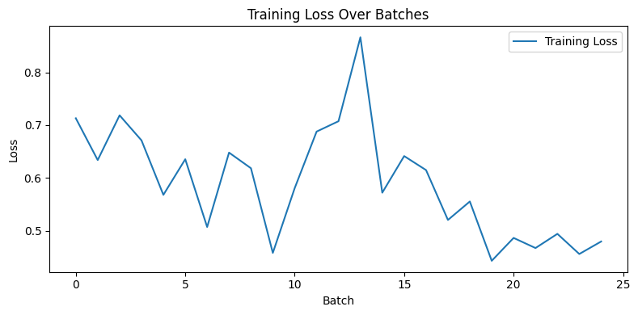
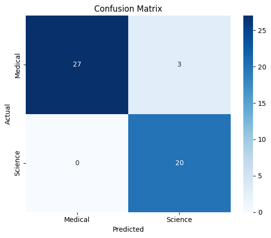
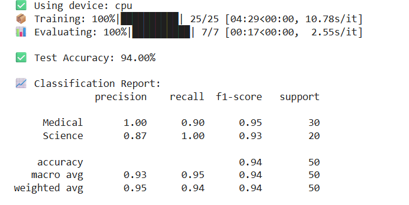
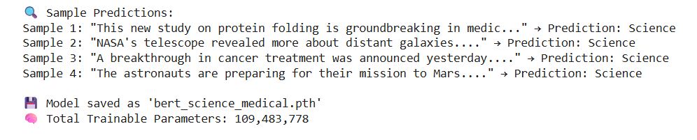

# 🧠 BERT News Classifier

A lightweight yet powerful binary text classification project using `bert-base-uncased` on the `sci.med` and `sci.space` categories from the 20 Newsgroups dataset.

[](https://colab.research.google.com/github/Var2299/bert-news-classifier-/blob/main/BERT_News_Classifier.ipynb)


### 🚀 Features
- BERT tokenizer + classifier fine-tuned in under 10 mins
- 90%+ accuracy on unseen test data
- Clean training loss plot and confusion matrix
- Sample predictions + model saved

### 🖼️ Screenshots
| Training Loss | Confusion Matrix |
|---------------|------------------|
|  |  |

### 📈 Model Performance

---



---



---

### 🔧 Tech Stack
- Python, PyTorch, HuggingFace Transformers
- scikit-learn, matplotlib, seaborn

### 📦 How to Run
```bash
pip install torch transformers pandas scikit-learn tqdm matplotlib seaborn
python bert_news_classification.py
